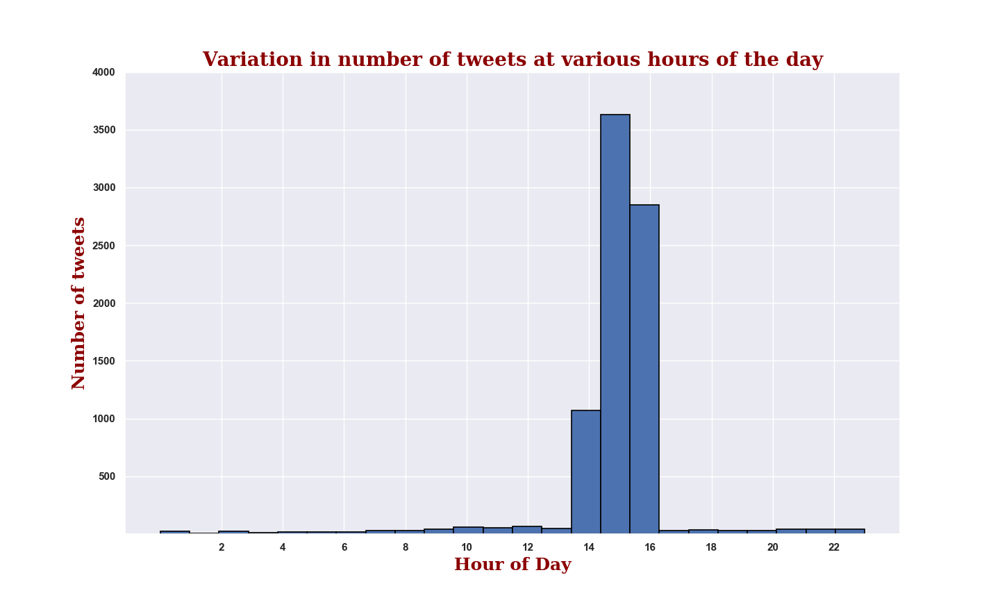
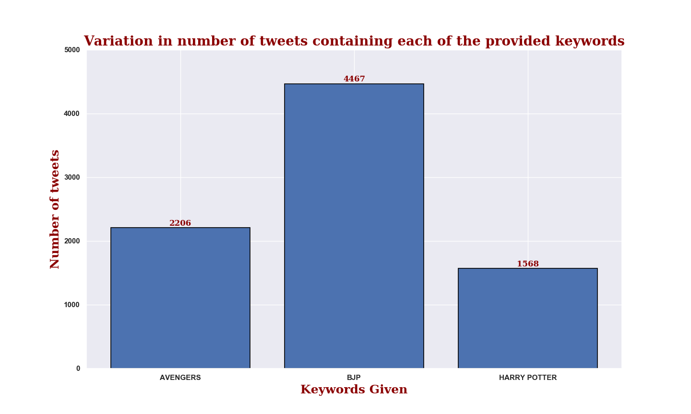
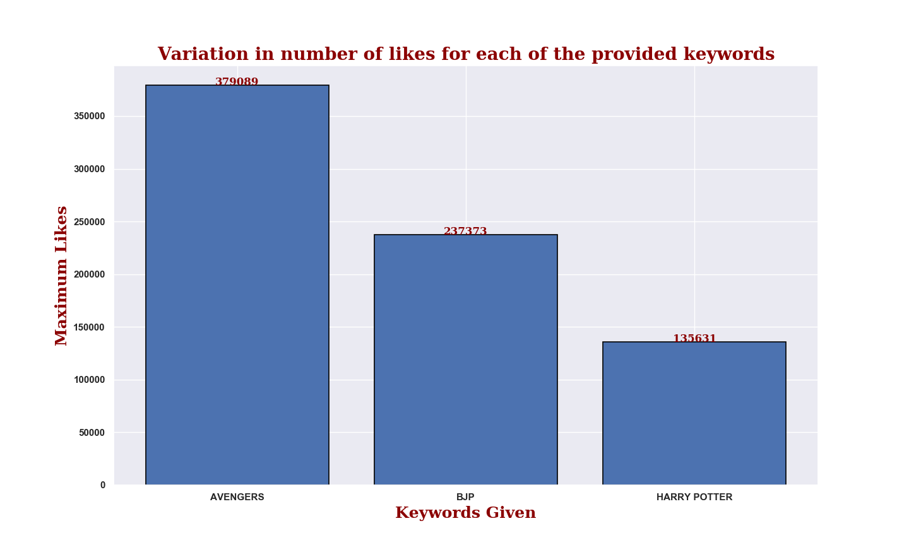
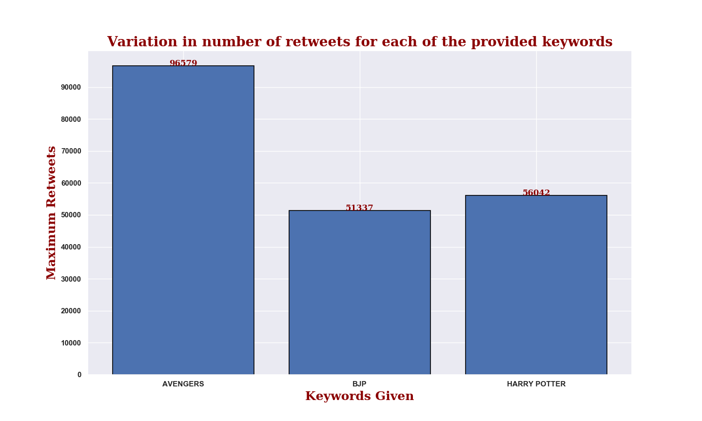
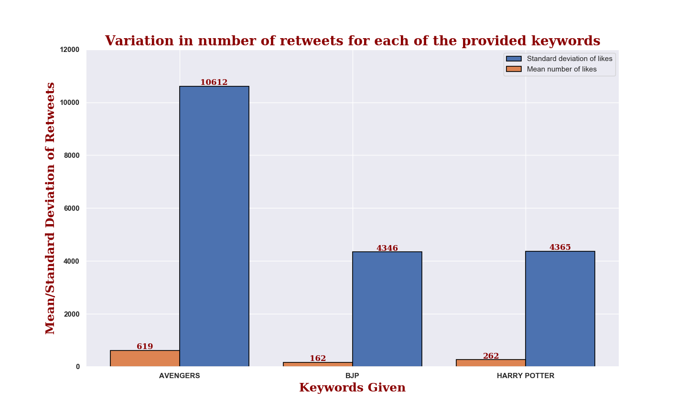
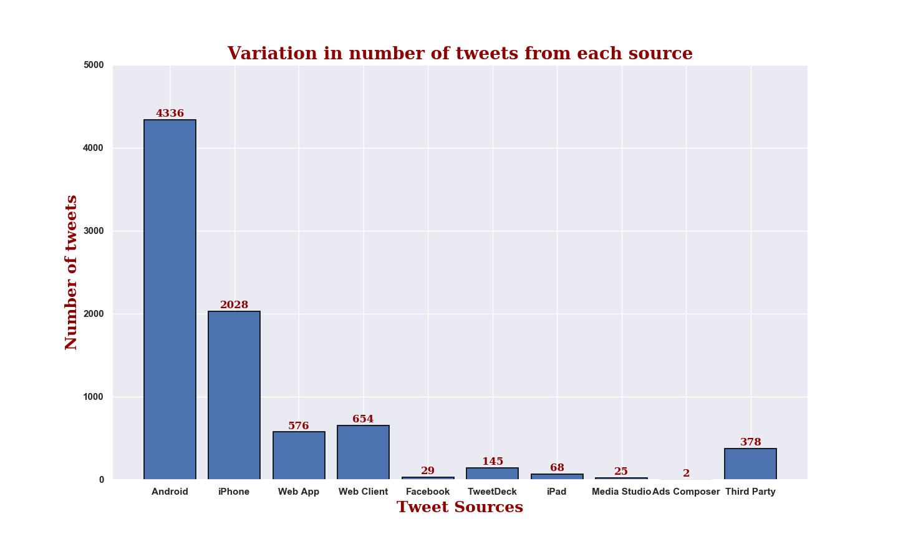
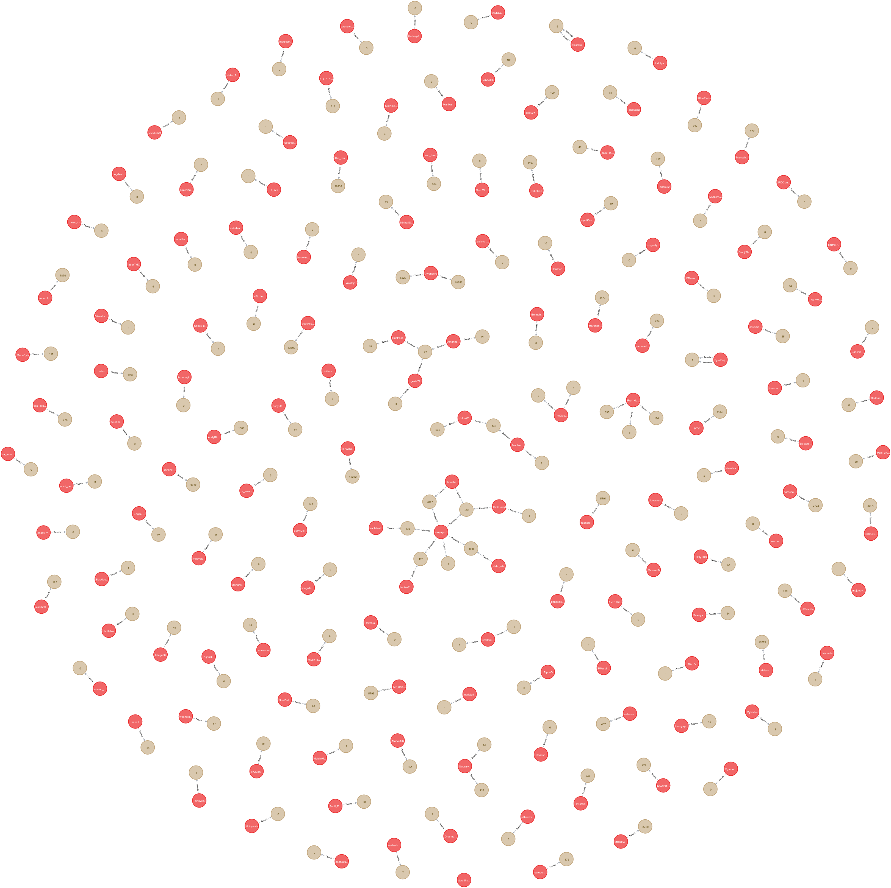

# TwitterDataAnalysis
This twitter repository consists of all the code written and used over the course of my Summer Training Project under the guidance of Mr. Gurucharan Bulusu.
## About the Project
The aim of the project is to get a large dataset of Tweets from Twitter use the data to perform analytics and produce graphs to answer various questions about the data. Additionally, a graph database of the data is created which links together users and their tweets.
The project was completed in three stages:

1. Gathering Tweets from Twitter

2. Collecting useful data from Tweets and drawing graphs

3. Creating a Graph Database which links users and tweets together
## Gathering Tweets from Twitter
A large data set of tweets containing the given  _search terms_  are obtained from twitter by using the Twitter Streaming API. In order to use the API, a Twitter Developer Id is created which enables you to get the API KEY, API SECRET KEY, ACCESS TOKEN and ACCESS TOKEN SECRET. These are needed to authenticate the developer and allow the developer to use the API.

The Twython python module is used in the project to access the Twitter Streaming API. A Twitter Stream Wrapper is created to authenticate the developer, provide the _search terms_ which need to be in a Tweet which is being streamed and mention the number of tweets that need to be downloaded

And finally, a function is need to save the downloaded tweets into file with a unique name.

In this project, **Avengers**, **BJP** and **Harry Potter** are used as the _search terms_ and **10000 Tweets** have been downloaded.

_main.py_, _twitter_stream.py_, _search_terms.json_ and _twitter_connection_config.json_ are the files in the repository which pertain to this stage of the project
## Collecting useful data from Tweets and drawing graphs
The downloaded tweets are stored in a _tweetFile_. The next part of the project involves collecting useful data from a Tweets and storing in a from such that it can be easily accessed while drawing graphs.

In the project, analysis is performed on those Tweets which contain any one of the _search terms_ in their text. If the Tweet obtained from the file is a Retweet, then the original Tweet of the Retweet in also considered for analysis if the any one of the _search terms_ are present in the text.

A class named _Tweet_Analyser_ is created which acts as the brain for performing data analysis. It retrives the useful tweets from the _tweetFile_. It also stores the **Tweet ID**,**Tweet Text**,**Date and tme of creation**,**Favorite Count**,**Retweet Count** and **Keyword** present in a tweet in the form of a pandas DataFrame. It also does the same for Retweet and for the original Tweet of a Retweet.

Using the data present in the DataFrame, graphs are produced using the matplotlib module

In the course of this project, the following graphs have been produced:

_analytics.py_ and _tweet_d1fdaab1-b8c1-4f6b-b7e9-17844d8d6186.json_ are the files in the repository which pertain to this stage of the project and _plot_keyword_bar.png_, _plot_likesMeanStd_bar.png_, _plot_maxLikes_bar.png_, _plot_maxRetweets_bar.png_, _plot_retweetsMeanStd_bar.png_ and _plot_time_hist.png_ are the filenames of the graphs produced
## Creating a Graph Database which links users and tweets together
The next stage of the project involves creating a graph database with the Tweet data obtained in order to link together the users and their tweets and retweets. In this project, the graph database is created using neo4j and the required python code is written with the module py2neo.

In the database, the data is modelled in the following way:
1. Every user is represented by a **User** Node with **UserID** and **ScreenName** as its properties
2. Every original tweet is represented by a **Tweet** Node with **TweetID**,**Text**,**Likes**,**Retweets** as its properties
3. A user and his/her original tweet are related by **Tweets** Relationship wherein a **(:User)-[:Tweets] ->(:Tweet)**
4. A user and his/her retweet are realted by **Retweets** Relationship with **TweetID**,**Text**,**Likes**,**Retweets** as its properties wherein a **(:User)-[:Retweets] ->(:Tweet)**

Since the useful tweets have been filtered in the previous stage and stored in a DataFrame, hence, only the useful tweets are obtained from the file for creating the Graph Database. This is done by comparing the Tweed ID of the tweet in the file with that present in the DataFrame.

Finally, data is added to the database using py2neo.

This following is the graph showing the database created and the relationships between users and tweets:

_graphDB.py_, _analytics.py_ and _tweet_d1fdaab1-b8c1-4f6b-b7e9-17844d8d6186.json_ are the files pertaining to this stage of the project
